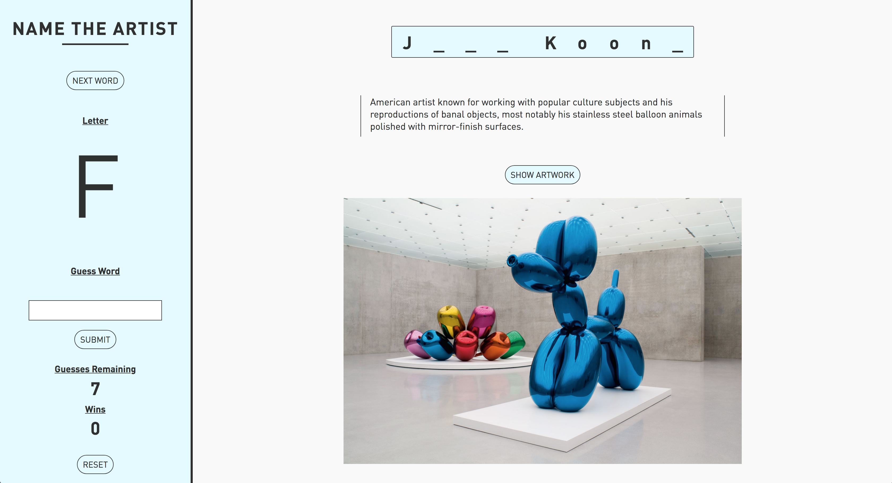

# Name The Artist

The goal is to create a single-page website application that allows the user to play a simple game of Wheel of Fortune / Hangman. The specific game I created is called 'Name the Artist' and requires the user to determine what artist matches the description and/or artwork shown.

## How to Play

On load, a random artist is selected and a textual description of his/her work appears. If the user finds it too difficult to guess based on the description there is a 'Show Artwork' button that displays a work of art by the artist as an additional hint. The sidebar functionality is integral to how the game is played. Underneath the 'Next Word' button, a letter that is typed on the user's keyboard will always be displayed. After a letter is chosen and 'ENTER' is pressed, that user submits the letter as a guess for the word's characters. Underneath that there is also an option for the user to submit a guess for the exact artist/word (not characters). Minor statistics are displayed such as the number of successful wins the user accomplished and the number of incorrect guesses remaining until a loss. On win or loss, a modal appears in the center of the main content area as a response to the user.

### Artists

Egon Schiele, Jasper Johns, Cy Twombly, Claes Oldenburg, Caravaggio, Wassily Kandinsky, Jean-Michel Basquiat, Takashi Murakami, Shepard Fairey, Barbara Kruger, Gustav Klimt, Yayoi Kusama, Keith Haring, Edgar Degas, James Turrell, Richard Serra, Jeff Koons, Vincent Van Gogh, Banksy, Michelangelo, Pablo Picasso, Andy Warhol, Leonardo Da Vinci, Claude Monet, Jackson Pollock, Mark Rothko, Roy Lichtenstein, Salvador Dali, Georgia O'Keefe.

## Built With

* HTML
* CSS / SASS
* JavaScript

## Authors

* **Michael Chung**

## Acknowledgments

* StackOverflow
* Oggi Danailov
* NYCDA
